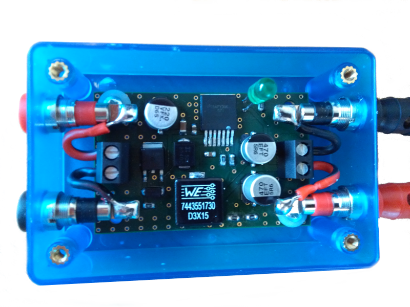

## Overview
One objective of this project was to replace the power supply prototype setup (see figure below). Three battery packs and a linear regulator with heat sink have been used. The power supply has to provide 19 V for the Intel NuC board and 12 V for the Microsoft Kinect. 

Because of the low efficiency of the linear regulator and the necessary heat sink it was decided to use a switching regulator. One principle of the project is to design independent and reusable components. Therefore the PCB is designed to provide different output voltages by assembling the appropriate solenoid and resistors. The other assembling components need not to be changed. 
A casing has been chosen which allows the connection of banana jacks or screw clamps. A green LED lights up if an input voltage has been applied. A reverse polarity protection circuit is integrated too. The PCB with casing is shown in the figure below. 

